# 🚘 Yong Jin Park 
### Spatial Data Engineer | Data Analyst | Mobility Business Strategist | Ph.D. Candidate

---

## 📖 About Me

### 💡 연구를 서비스로 연결하는 교통·공간데이터 엔지니어 & 연구기획 & 데이터 분석가
데이터 기반 의사결정 구조를 설계하여 공공 모빌리티 사업과 교통 안전 전략을 실행하는 교통공학 기반 데이터 전략가입니다.
교통안전 문제를 **PostGIS**와 **Python** 기반 공간데이터 파이프라인으로 정리하고, AI 모델과 공공 플랫폼이 실제로 사용할 수 있는 형태로 연결해 왔습니다.

* 🎓 **서울시립대학교 일반대학원 교통공학과 박사수료** (Ph.D. Candidate @ University of Seoul)
* 🏢 **웨이즈원(주) 기술연구소 책임** (현대오토에버 협력사 / @ Ways1 Inc. in 경기도 성남시 판교)
* 🧠 **교통 연구 및 모빌리티 산업 경력 10년** (10 Years in Mobility Industry)

---

## 📊 GitHub Stats & Activities

  
  

  

---

## 🚀 내가 만드는 가치 | What I Deliver 

- **AI 교통안전 국책과제 수주**: 14:1 경쟁률의 과제 수주 및 실무책임 수행  
- **GPS 맵매칭 자동화 파이프라인 구축**: 전국 화물차 위험주행행동 GPS 데이터 기반 자동화 파이프라인 구축 (수작업 기준 1주일 작업소요시간을 3시간으로 단축)
- **도메인 기반 사업 기획**: 교통공학 도메인을 사업 의사결정 인사이트로 전환하여 신사업 아이템 제안으로 과제 2건 계약 성사 ([관련 링크](https://blog.naver.com/getcarvi2021/222993314515))
- **정책 솔루션 제시**: 명절 기간 교통사고 발생 위험도 구간 도출 및 국토교통부 보고 -> 링크 군집화를 통한 정책 솔루션 제시
- **이종 직군 및 이해관계자 협업 조율**: 백엔드·프론트엔드 개발자 및 국토교통부·공단 관계자와의 의사소통 간 윤활유 및 추진 역할로 AI 기반 모빌리티 솔루션을 실증 단계로 확장하고 후속 과제를 확보

---

## 🛠️ Tech Stack & Tools

<table width="100%">
  <tr>
    <td valign="top" width="50%">
      <h4>💻 Languages & Databases</h4>
      
      
       
      
      
      
    </td>
    <td valign="top" width="50%">
      <h4>📊 Data Science & AI</h4>
      
       
      
      
      
    </td>
  </tr>
  <tr>
    <td valign="top" width="50%">
      <h4>🤖 Web Automation & Bots</h4>
      
       
      
    </td>
    <td valign="top" width="50%">
      <h4>🧠 AI Harness Tools</h4>
      
      
    </td>
  </tr>
  <tr>
    <td valign="top" width="50%">
      <h4>🔧 Tools & VCS</h4>
      
      
    </td>
    <td valign="top" width="50%">
      <!-- Spacing -->
    </td>
  </tr>
</table>

---

## 🐍 Contribution Snake

  <picture>
    <source media="(prefers-color-scheme: dark)" srcset="./github-contribution-grid-snake-dark.svg">
    <source media="(prefers-color-scheme: light)" srcset="./github-contribution-grid-snake.svg">
    
  </picture>

